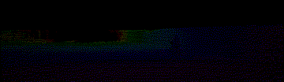
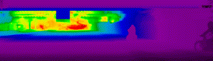
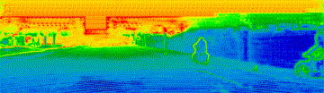
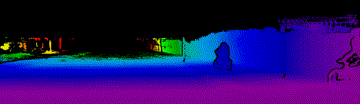
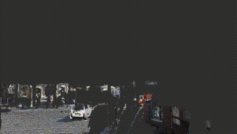
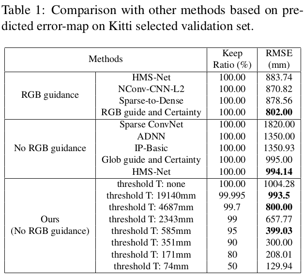
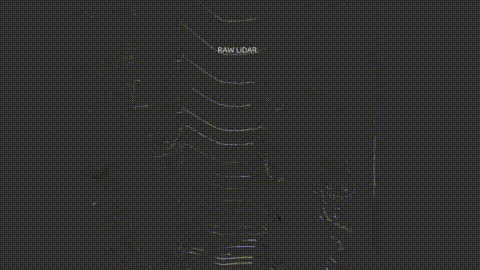
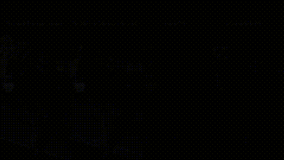
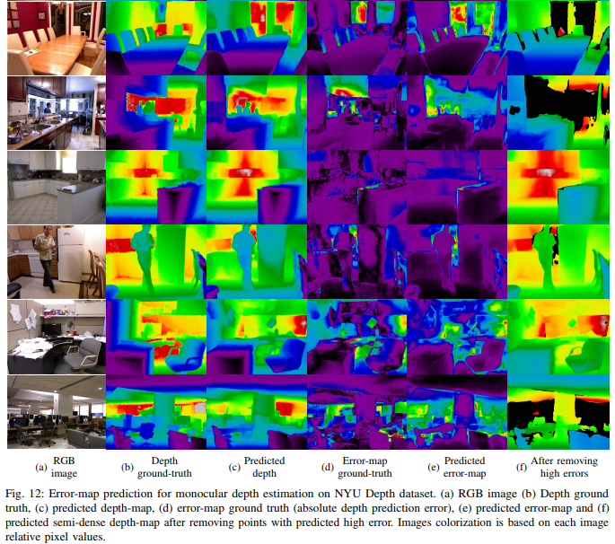

# Conf-Net: Depth Completion with Error-Map
Tensorflow implementation of our paper [Conf-Net: Predicting Depth Completion Error-Map For
High-Confidence Dense 3D Point-Cloud](https://arxiv.org/abs/1907.10148).

# Introduction
This work proposes a new method for depth completion of sparse LiDAR data using a convolutional neural network which learns to generate ”almost” full 3D point-clouds with significantly lower root mean squared error (RMSE) over state-of-the-art methods. Our main contributions are listed below:

* We propose a novel method to predict a high-quality pixel-wise error-map. Our approach outperforms existing methods in terms of uncertainty and confidence maps.
* Our approach generates industry-level clean (high confidence - low variance) 360 ◦ 3D dense point-cloud from sparse LiDAR point-cloud. Our point-cloud is 15 times denser than input (which is Velodyne HDL 64 point-cloud) and 3 times more accurate than the state-of-the-art (RMSE = 300mm).
* We conduct the uncertainty based analysis of Kitti depth completion dataset for the first time.


See the full demo on [Youtube](https://www.youtube.com/watch?v=owd8QeUkjvA).

| <p align="center">Network input/outputs</p>  | <p align="center">Purged 3D point-cloud</p> |
| ------------- | ------------- |
| <br/><p align="center">Sparse Depth (Input):<br/> <br/> Predicted Dnese Depth (RMSE: 1000mm):<br/> <br/> Predicted Pixelwise Error-Map:<br/> <br/> Purged Dense Depth (RMSE: 300mm):<br/> </p>|<p align="center">
</p>

<!--*Point-Cloud in 3D:*





-->
Results on Monocular Depth Estimation on NYU Depth V2:



## Installing
The code is tested with Cuda 9 and tensorflow 1.10 on Titan V.<br/>
We suggest using our docker to run the code.<br/>
(The docker includes Cuda 9 with tensorflow 1.10, ros kinetict and pcl library for point-cloud visualization.)
```
bash docker_run.sh
```
## Training

```
python ./main/depth_completion.py train
```
## Testing
```
python ./main/deploy_haval.py
```


